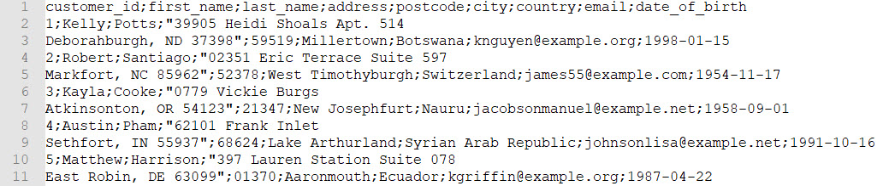
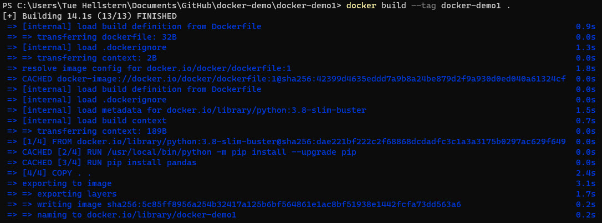
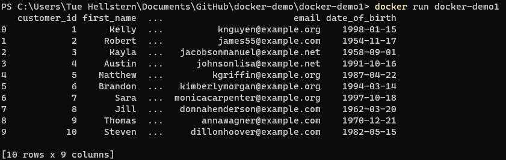

# Using Docker, Python and Pandas :trophy:
Using a Docker container to run a Python application using Pandas library to import the **customers.csv** file. 



You are going to use:

- Docker
- Python
- Pandas

In the development of a applications you need a consistent environment across all your devices.
It can be time consuming to install all the dependencies from scratch whenever you try to run your code on a new device or in a new environment.

> **Docker is here to solve exactly this problem.**

Docker provides a way to package everything you need to run your applications in a Container which you can download or pull into all the devices you use and just start working right away.

## Files
The files for this demo i located in the folder **docker-demo1**

- customers.csv
- demo1_app.py
- Dockerfile

## Steps
There are 3 steps in this demo:

1. Installing Python and Pandas onto our system and making the Python application
2. Creating a Docker Image file which will be used to make a Container
3. Testing the container

## Installing Python and Pandas onto our system and making the Python application

1. Install Python if its on on your system
2. Install Pandas using

```
pip3 install pandas
```

3. Create a project directory and call it **docker-demo1**
4. In the **python-docker-demo1** folder, make a new python file and give a name **demo1_app.py**
5. Write this code in the **demo1_app.py** file

```
import pandas as pd
df = pd.read_csv('customers.csv')
print(df.head(10))
```
    
6. Run the Python file to make sure that everything is working

## Creating a Docker Image file which will be used to make a Container

1. Install Docker by going to there website and following the installation steps - https://docs.docker.com/engine/install/
2. Make a new file in your **docker-demo1** directory and name it **Dockerfile**. *Be sure **not** give it an extension.*
3. Write this code in the file:

```
# syntax=docker/dockerfile:1
FROM python:3.8-slim-buster
RUN /usr/local/bin/python -m pip install --upgrade pip
RUN pip install pandas
COPY . .
CMD [ "python", "demo1_app.py"]
```

- **First line** tells the docker engine on how to read/parse the lines coming after it. This line always has to be the first line before any spaces or characters
- **Second line** downloads a base python image from Dockerhub. It is an environment that already has python installed on it
- **Third line** upgrades the Pip as the above image is running an old version of it
- **Fourth line** installs Pandas library in the image. This is a crucial step that we will also use to test our Docker image next
- **Fifth line** copies all the files in the current directory and stores them onto the file system attached with the docker image
- **Sixth line** tells Docker image on what to do when the Run command is given

4. Open to your **commandpromt** and make a docker image by typing:

```
docker build --tag docker-demo1 .
```



*Make sure that Docker demon is running*

# Testing the container

1. Run the docker image by typing, in your commandpromt:

```
docker run docker-demo1
```

Now you will see the Pandas dataframe on the screen.



**Rember** - If you make any changes you have to run

```
docker build --tag docker-demo1 .
```
**before** you run 

```
docker run docker-demo1
```
